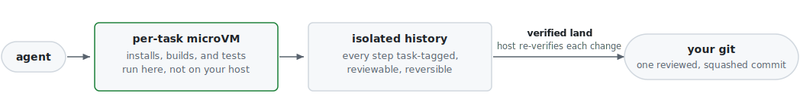

<p align="center">
  <h1 align="center">mgit</h1>
  <p align="center">
    <strong>Sandboxed version control for autonomous coding agents.</strong>
  </p>
  <p align="center">
    <sub>Part of the <a href="https://github.com/hyper-swe">HyperSwe</a> suite.</sub>
  </p>
  <p align="center">
    <a href="https://github.com/hyper-swe/mgit/releases"></a>
    <a href="https://github.com/hyper-swe/mgit/actions/workflows/ci.yml"></a>
    <a href="go.mod"></a>
    <a href="LICENSE"></a>
    
  </p>
</p>

**mgit is a sandboxed, version-controlled workspace for autonomous coding agents.** It runs an agent's untrusted code (dependency installs, builds, and tests) in a disposable per-task microVM, and records the agent's work in an isolated, append-only store separate from the project's git. Each change is tagged to the task that produced it, and only the reviewed, squashed result is landed into the repository.

Coding agents increasingly run unattended, installing packages and executing build and test commands as they iterate. mgit makes that safe on a real codebase: execution is contained to a throwaway VM with access limited to what the task needs, the project's git is never modified directly, and every step the agent takes is preserved as a traceable, reviewable record.

<p align="center">
  <picture>
    <source media="(prefers-color-scheme: dark)" srcset="docs/assets/containment-flow-dark.svg">
    
  </picture>
</p>

### What you get

- 🛡️ **Sandboxed execution**: installs, builds, and tests run in an isolated VM, never on the host.
- 🔒 **Default-deny networking**: the agent reaches only what the task needs; your secrets and network stay unreachable.
- ✅ **Verified land**: only changes that pass host-side re-verification (dual-hash, task binding, host-anchored attestation) reach your repo.
- 🧬 **Isolated, clean history**: intermediate work stays in mgit's own store; only the squashed result lands in your git, and you can roll back or branch from any step.
- 📜 **An audit trail you can stand behind**: append-only, task-tagged, dual-hash-verified history; trace any landed change back to the task, the agent, and every step that produced it.
- 🤝 **Multi-agent parallelism**: per-task worktrees and per-task sandboxes let agents work different tasks side by side without collisions.
- 🔌 **Fits what you have**: runs over your existing git repo without touching `.git`, stays in sync with it automatically, and wires into Claude Code, Codex, and Cursor with one command.

> *"Six tickets, zero conflicts, and `squash --to-git` round-trips byte-for-byte. The microVM sandbox is the one capability plain git worktrees fundamentally lack."*
> <br><sub>Independent team that integrated their own project through mgit</sub>

## Quick start

Two minutes, on top of your existing repo. Nothing to migrate; your git is left untouched.

Install with Homebrew (macOS / Linux):

```bash
brew install hyper-swe/tap/mgit
```

or with Go:

```bash
go install github.com/hyper-swe/mgit/cmd/mgit@latest
```

Start an agent on a task. `mgit work` provisions a task-bound worktree and wires the agent's harness; with `--sandbox` it also launches the task's microVM. The `--sandbox` leg requires [enabling the sandbox](#enable-the-sandbox) first (the daemon and a guest image); everything else in this walkthrough works without it.

```bash
mgit init                                    # set mgit up alongside your existing git repo
mgit work ./wt-PROJ-12 --task-id PROJ-12 \
  --sandbox --image base@sha256:<hex> --network allowlist --allow registry.npmjs.org
```

Inside that worktree, the agent's commands execute in the guest VM, and each coherent step becomes a task-tagged micro-commit:

```bash
cd ./wt-PROJ-12
mgit run -- npm install                 # runs in the microVM, never on the host (fail-closed)
mgit commit -m "add validation helper"  # task ID auto-inherited from the worktree
mgit run -- npm test
mgit commit -m "wire validation into handler"
```

Review, squash, and land:

```bash
mgit log --task-id PROJ-12 --oneline    # the step-by-step history is the review surface
mgit diff --task-id PROJ-12
mgit squash --task-id PROJ-12           # one reviewable commit for the whole task
mgit sandbox land --task-id PROJ-12     # host-verify and append into your real repo
```

If a decision turns out wrong mid-task, [backtrack, fork, and salvage](#course-correction-a-checkpointed-working-substrate) instead of rewriting from scratch. Agent harnesses (Claude Code, Codex, Cursor) are wired automatically by `mgit work`, so all of this is transparent to the agent.

> **Worktree notes.** An mgit worktree is **not** a git repo (no `.git`); integrate by exporting the squash as a patch (`mgit squash --task-id <ID> --to-git | git apply`), never by running `git` inside the worktree. Gitignored build artifacts (e.g. an embedded `web/dist`) are not seeded into worktrees; list them in `.mgit/seed-include` (one glob per line) to carry them in.

<p align="center">
  <a href="#why-this-exists">Why</a> &middot;
  <a href="#how-containment-works">Containment</a> &middot;
  <a href="#course-correction-a-checkpointed-working-substrate">Course-correction</a> &middot;
  <a href="#an-audit-trail-for-agent-work">Audit</a> &middot;
  <a href="#installation">Install</a> &middot;
  <a href="#commands">Commands</a> &middot;
  <a href="#security-model">Security</a> &middot;
  <a href="#scope-and-current-status">Scope</a>
</p>

---

## Why this exists

An autonomous agent working a task routinely executes code no one has read: a single `npm install` runs the install hooks of hundreds of transitive dependencies, and supply-chain attacks on public registries are reported weekly. When the agent runs directly on your machine, that code runs with your privileges, alongside your credentials and every other repository you have, and there is no version control for a leaked key. Containment has to happen before execution, not after.

mgit provides that containment, and pairs it with a working history built for how agents actually work: many small steps, some of them wrong, that need to stay reviewable and reversible without polluting the project's git.

## How containment works

mgit runs the agent's untrusted execution inside a **per-task microVM** (Firecracker on Linux/KVM; Apple Virtualization.framework on macOS, running a Linux guest), so the blast radius of a compromised package is a disposable VM, not your host:

- **Hardware-isolated execution.** Installs, builds, and tests run in the guest VM. The host filesystem, your other repos, and your credentials are never mounted in. The microVM boundary is the same one cloud providers trust to isolate tenants.
- **Default-deny egress.** The guest gets no direct network route. A per-task allowlist permits only the destinations a task actually needs (e.g. your package registry), enforced at the IP/flow layer by a host-side proxy. Raw-IP, QUIC, DNS-tunnelling, and metadata-endpoint tricks are denied. (`none` / `allowlist` / `open` modes.)
- **A verified airlock back to your repo.** The agent commits inside the sandbox; only its changes are pulled back over a dedicated channel, re-verified host-side (dual-hash, task binding, and a host-anchored attestation the guest cannot forge), and appended to your real repository. Nothing the guest produces reaches your repo unverified.
- **Fail-closed routing.** `mgit run -- <command>` transparently routes the agent's execution into the task's sandbox; if the sandbox is unavailable it fails closed and never silently runs on the host.

This is mgit's first job: make running agents in auto mode safe by default. The version-control layer below is the airlock that lets contained work flow back out cleanly. The isolation boundary has been adversarially audited; see [Security model](#security-model).

## Course-correction: a checkpointed working substrate

Contained execution gets work *in* safely. The other half is giving the agent a place to **work** that keeps your real repo clean and lets you undo a wrong decision without throwing away the good work around it.

Instead of crowding your git history with agent micro-commit noise, the agent commits each small, coherent step into an **isolated `.mgit` store**, a self-contained go-git repository that provably never touches your project's `.git`. That gives you a checkpointed timeline of the agent's reasoning that you can rewind, fork, and salvage from:

```
mgit work -> commit -> commit -> commit -> (wrong lib chosen) -> commit
                          \                        |
                           \                       +-- rollback: revert the wrong step (append-only)
                            \                              |
                             \                             +-- checkout -b: fork a new line, continue the right way
                              \                                          |
                               +-- restore the good bits from -----------+
                                   any earlier checkpoint
                                   (the old line stays preserved in history)
                                                  |
                                                  +-- squash -> land only the reviewed result
```

When a decision turns out wrong, you don't reprompt the agent to rewrite hundreds of lines from scratch:

1. **Backtrack**: `mgit rollback` reverts the wrong step's task as a new commit and restores the pre-task state in your working tree; nothing is deleted, and the wrong attempt stays in the history.
2. **Fork**: `mgit checkout -b` opens a new line, preserving the old attempt.
3. **Salvage**: `mgit restore --all --commit <hash>` returns the whole tree to any checkpoint (or a single file without `--all`), and `mgit cherry-pick` applies a still-good step from the old line, content and provenance both.
4. **Squash**: the corrected micro-commits land as one reviewable commit.

Micro-granularity earns its keep *in-task* (cheap course-correction plus a fine-grained review surface); the landed artifact is the squashed result. **You can always see and undo exactly what the agent did**: every step, including the abandoned line, stays in an append-only history for review.

## An audit trail for agent work

When an agent's change breaks something weeks later, `git blame` tells you which commit; mgit tells you the story behind it. The store is append-only (rollbacks create revert commits, nothing is ever deleted), every commit carries its task and agent identity, and integrity is dual-hashed (SHA-1 for git compatibility, SHA-256 for tamper detection):

```bash
mgit audit --task-id PROJ-12     # who did what, when, in order (including rollbacks)
mgit log --task-id PROJ-12       # every micro-step behind the landed commit
mgit verify --task-id PROJ-12    # prove the recorded chain has not been tampered with
```

That turns incident forensics from archaeology into a query: trace a landed commit back to its task, the agent that worked it, and every intermediate step including abandoned attempts; scope a regression's blast radius by asking what else that task touched. The trail is available for as long as the `.mgit` store is retained alongside the repo, which is how HyperSwe deployments run it.

## Installation

**Homebrew** (macOS / Linux):

```bash
brew install hyper-swe/tap/mgit
```

**Go**:

```bash
go install github.com/hyper-swe/mgit/cmd/mgit@latest
```

**From source**:

```bash
git clone https://github.com/hyper-swe/mgit.git && cd mgit && make build
```

**Binary releases**: pre-built binaries for Linux, macOS, and Windows (amd64 and arm64) are on [GitHub Releases](https://github.com/hyper-swe/mgit/releases).

Everything above installs the `mgit` binary, which is all you need for the version-control workflow: init, worktrees, commit, log, squash, and landing by patch. The microVM sandbox (`mgit run`, `mgit work --sandbox`) is a separate, optional layer with its own prerequisites.

### Enable the sandbox

The sandbox needs a second host binary, `mgit-sandboxd`, and a guest image. On Linux and macOS arm64, Homebrew and the release archives install `mgit-sandboxd` next to `mgit` automatically; you can also `go install github.com/hyper-swe/mgit/cmd/mgit-sandboxd@latest`.

- **Linux** requires KVM (`/dev/kvm`) and the `firecracker` binary on `PATH`.
- **macOS** requires Apple Silicon (arm64), macOS 13+; the release/brew daemon is code-signed with the virtualization entitlement (a `go install`-ed daemon is unsigned and must be signed locally).
- **Windows and Intel macOS** have no sandbox backend yet; core mgit runs without it.

The daemon boots a guest image (kernel + rootfs) that must be provisioned and pinned separately. The full walkthrough, platform prerequisites, and the guest-image story are in [docs/INSTALL-SANDBOX.md](docs/INSTALL-SANDBOX.md).

**Without the sandbox**, mgit is still a complete checkpointed working substrate. `mgit run` and `mgit sandbox land` are the only sandbox-gated commands; integrate a task's result by exporting its squash as a patch and applying it to your git:

```bash
mgit squash --task-id PROJ-12 --to-git | git apply   # or: git am
```

## Commands

The everyday surface:

| Command | Description |
|---------|-------------|
| `mgit init` | Set mgit up alongside your existing git repo |
| `mgit work PATH --task-id ID [--sandbox --image REF]` | Start an agent on a task: worktree + agent wiring + optional microVM |
| `mgit run -- <command>` | Run a command in the task's microVM (fail-closed; never on the host) |
| `mgit commit -m MSG` | Create a task-tagged micro-commit (task ID auto-inherited in a worktree) |
| `mgit log --task-id ID` | View a task's step-by-step history |
| `mgit rollback --task-id ID [--commit HASH]` | Revert a task: an append-only revert commit that also restores the working tree |
| `mgit audit --task-id ID` | Replay who did what, when, from the append-only audit trail |
| `mgit squash --task-id ID [--to-git]` | Consolidate a task's micro-commits into one reviewable commit |
| `mgit sandbox land --task-id ID` | Pull, host-verify, and land the sandbox's changes into your repo |

All commands support `--json` for structured output. `mgit run` and `mgit sandbox land` are the only sandbox-gated commands; see [Enable the sandbox](#enable-the-sandbox). Without a sandbox, land a task with `mgit squash --task-id ID --to-git | git apply`.

<details>
<summary><strong>Core</strong> (init, commit, log, status, show, branch, config)</summary>

| Command | Description |
|---------|-------------|
| `mgit init` | Initialize a new mgit repository |
| `mgit commit --task-id ID` | Create a task-tagged micro-commit |
| `mgit log [--task-id ID]` | View commit history, optionally filtered by task |
| `mgit status` | Show working tree status |
| `mgit show HASH` | Display commit details |
| `mgit branch --task-id ID` | Create a task branch |
| `mgit branch` | List all branches |
| `mgit config get/set/list` | Manage configuration |

</details>

<details>
<summary><strong>Workflows</strong> (squash, rollback, verify, audit, export)</summary>

| Command | Description |
|---------|-------------|
| `mgit squash --task-id ID [--to-git \| --to-main]` | Consolidate micro-commits into one |
| `mgit rollback --task-id ID [--commit HASH]` | Revert a task: an append-only revert commit that also restores the working tree (a step's hash resolves its task) |
| `mgit verify [--task-id ID] [--fix]` | Verify commit chain and index integrity |
| `mgit audit [--task-id ID] [--since --until]` | View the audit trail |
| `mgit export --task-id ID --format json\|git\|audit-log` | Export task data |

</details>

<details>
<summary><strong>Multi-agent</strong> (work, worktree)</summary>

| Command | Description |
|---------|-------------|
| `mgit work PATH --task-id ID [--sandbox --image REF]` | Start an agent on a task: task-bound worktree + agent-shell wiring + optional sandbox |
| `mgit worktree add PATH --task-id ID [--branch]` | Create an isolated worktree without the agent-shell wiring |
| `mgit worktree list [--porcelain]` | List active worktrees |
| `mgit worktree remove PATH [--force]` | Remove a worktree |
| `mgit worktree prune [--dry-run]` | Remove stale worktree metadata |

</details>

<details>
<summary><strong>Sandbox / agent execution</strong> (run, sandbox launch/exec/shell/land/grants/image)</summary>

| Command | Description |
|---------|-------------|
| `mgit run -- <command>` | Run a command inside the current worktree's task microVM (fail-closed) |
| `mgit sandbox launch --task-id ID --worktree PATH --image REF` | Provision a sandbox for a task |
| `mgit sandbox exec --task-id ID -- <command>` | Execute one command in the task's sandbox |
| `mgit sandbox shell --task-id ID` | Attach an interactive session (confined-agent mode) |
| `mgit sandbox land --task-id ID` | Pull + host-verify + land the sandbox's changes |
| `mgit sandbox status ID` / `list` / `remove ID` | Inspect or tear down sandboxes |
| `mgit sandbox grants --task-id ID` / `grant --task-id ID KEY` | Review and approve per-task egress requests |
| `mgit sandbox image init` / `add --kernel … --rootfs …` | Manage the signed, digest-pinned guest image set |

Sandbox commands require the host daemon and a guest image, and run on Linux (Firecracker/KVM) and macOS (Virtualization.framework).

</details>

<details>
<summary><strong>Additional</strong> (add, diff, checkout, merge, cherry-pick, restore, gc, import, docs)</summary>

| Command | Description |
|---------|-------------|
| `mgit add [files...] [--all]` | Stage files |
| `mgit diff [--from --to \| --task-id \| --staged]` | Show differences between commits, tasks, or staged files |
| `mgit checkout BRANCH` | Switch branches (blocks on uncommitted changes) |
| `mgit merge BRANCH [--squash \| --no-ff]` | Merge with fast-forward, squash, or no-ff strategy |
| `mgit cherry-pick HASH [--no-commit \| --onto]` | Apply a commit's changes to the current or target branch (conflict-safe, provenance-tagged) |
| `mgit restore [FILE] --commit HASH [--all]` | Restore a file, or with `--all` the whole working tree, from a checkpoint commit |
| `mgit gc [--aggressive]` | Pack loose objects and report space saved |
| `mgit import --file BUNDLE [--mode merge\|replace]` | Import a bundle with SHA-256 manifest verification |
| `mgit docs generate` | Generate agent-facing documentation |

</details>

## MCP and REST integration

mgit exposes 15 MCP tools for direct use by LLM coding agents (`mgit_commit`, `mgit_log`, `mgit_status`, `mgit_diff`, `mgit_squash`, `mgit_rollback`, `mgit_verify`, `mgit_audit`, `mgit_config`, `mgit_worktree_add/list/remove`, and more). Each tool delegates to the same service layer as the CLI, so semantics, validation, and the append-only audit guarantee are identical. The MCP server is `mgit serve --mcp-only` (stdio). It serves the current directory's repo by default, or the one given by `--project <path>` (use `--project` when the harness launches the server from an arbitrary working directory, e.g. the Claude desktop app):

```bash
# Claude Code (run from your project directory)
claude mcp add mgit -- mgit serve --mcp-only
```

```json
// Cursor (.cursor/mcp.json)
{ "mcpServers": { "mgit": { "command": "mgit", "args": ["serve", "--mcp-only"] } } }
```

```json
// Claude desktop app (claude_desktop_config.json) — pin the project explicitly
{ "mcpServers": { "mgit": { "command": "mgit", "args": ["serve", "--mcp-only", "--project", "/absolute/path/to/your/project"] } } }
```

A REST API (`mgit serve`) covers a deliberately minimal subset for same-host service integration: commits, branches, squash, rollback, and verify under `/api/v1/`. It always binds `127.0.0.1` and is unauthenticated by design; the trust model is same-user local processes, the same trust as running the CLI. The full parity matrix, including the formal REST scope decision, is in [docs/MCP-PARITY.md](docs/MCP-PARITY.md).

> A long-running `mgit serve` no longer blocks the CLI: it takes the repo lock only for the duration of each operation, so an agent driving mgit over MCP and a human using the CLI can work the same repo at once.

## mgit + mtix: a closed loop for AI coding

mgit pairs with [mtix](https://github.com/hyper-swe/mtix), an AI-native micro issue manager. Together they answer the two questions that matter for agent-driven development:

- **mtix**: *what was supposed to happen?* (the task, the acceptance criteria, who claimed it)
- **mgit**: *what actually happened?* (the commits, the diffs, the agent, the timestamps)

Task IDs flow between both systems: mtix decomposes a feature into micro-tasks, an agent claims one, mgit records every step as task-tagged commits, and when mtix marks the task done, mgit auto-squashes the work into a single reviewable commit. If a task went wrong, you roll back *that task*, and other tasks on the branch keep their work intact. **The unit of failure is a task, not a session.**

```bash
mtix ready                                 # 1. find work
mtix claim PROJ-4.2.1 --agent=claude-01    # 2. claim a task
mgit commit --task-id PROJ-4.2.1 -m "add validation"   # 3. task-tagged steps
mtix done PROJ-4.2.1                       # 4. done in mtix triggers mgit auto-squash
```

The result is requirement-to-commit traceability: not *"the AI did some work"* but *"agent claude-01 implemented PROJ-4.2.1 across these 7 commits, squashed at this timestamp, verified by chain hash X."*

## Security model

mgit's sandbox is designed around one premise: **the guest is the hostile party**. It runs the untrusted dependency code, so nothing it produces or asserts is trusted. The host is the trust anchor, and every guarantee is enforced host-side at the four places host and guest meet:

| Seam | Control |
|------|---------|
| **Execution boundary** | Per-task microVM (Firecracker / Virtualization.framework). Untrusted installs/builds/tests run in the guest; the host disk and credentials are never mounted in. |
| **Network egress** | Default-deny at the IP/flow layer. Per-task allowlist via a host proxy + restricted DNS; RFC1918, link-local, and cloud-metadata destinations denied unconditionally; UDP/QUIC blocked. |
| **Worktree mount** | The guest sees working-tree files only; the host's shared object store, index, and other tasks' data are not part of the guest view. |
| **Land / attestation** | Commits are re-verified host-side (dual-hash + task binding) and carry a **host-anchored attestation**: the guest holds no signing key and cannot forge provenance. Land is the only path from the guest's private store to your repo, and it is append-only. |

Additional properties: guest images are digest-pinned **and** Ed25519-signature-verified at boot; capability escalations (extra egress) are derived only from the host-observed denied connection, scoped to the sandbox lifetime, and audited (there is no "allow all"); the local daemon socket is same-UID peer-credential authenticated; a global concurrency + memory ceiling bounds host resource use.

This model has been **adversarially audited**: a red-team design audit plus an independent story-closure code review against each control, with the audit anchors checked into the repo ([`AUDIT-FR17-SANDBOX-V1.md`](AUDIT-FR17-SANDBOX-V1.md), [`AUDIT-FR17-SANDBOX-SECURITY-V1.md`](AUDIT-FR17-SANDBOX-SECURITY-V1.md)). The hardware-isolation boundary is the load-bearing guarantee; the seam-level defenses are under continuous, independently-reviewed hardening, and open findings are treated as release-gating.

## Scope and current status

mgit is in beta, and this section states plainly what is and is not there yet.

- **Sandbox platforms.** The microVM sandbox ships for Linux (Firecracker/KVM) and macOS, where the default profile runs a **Linux guest** under Apple Virtualization.framework (the right fit for Linux and cross-platform workloads). A mac-native profile for Swift/Xcode/Homebrew workloads is a planned opt-in. On Windows, mgit's core version control runs without the sandbox until the native backend lands.
- **What mgit is underneath.** mgit is git (go-git) plus an isolated store; the value is the agent workflow and the sandbox-to-land integration, not novel storage. The closest alternative is "git + a scratch-branch convention."
- **Course-correction maturity.** The backtrack/fork/salvage loop is content-restoring (rollback and restore recover working-tree state, cherry-pick applies real changes, all conflict-safe), e2e-tested, and instructed in the agent skills, but autonomous use by agents has not yet been validated head-to-head. Today the most reliable actor directing course-correction is a reviewer reading the history.
- **When plain git worktrees are enough.** If you push WIP freely and your agent runs only trusted code, native `git worktree` is lighter and git-native. mgit earns its keep when you can't or won't push WIP (an mgit worktree carries your unpushed local state), when you want a task-to-commit audit trail, and above all when the agent runs untrusted code, which is the capability plain worktrees fundamentally lack.

## Architecture

```
                    +-----------+
                    |  CLI (22) |
                    +-----+-----+
                          |
            +-------------+-------------+
            |                           |
      +-----+------+          +--------+--------+
      | REST API   |          | MCP Server (15) |
      | (10 routes)|          | (stdio/SSE)     |
      +-----+------+          +--------+--------+
            |                           |
            +-------------+-------------+
                          |
                 +--------+--------+
                 |  Service Layer  |
                 |  (13 services)  |
                 +--------+--------+
                          |
              +-----------+-----------+
              |                       |
       +------+------+        +------+------+
       |   go-git    |        |   SQLite    |
       |   Store     |        |   Index     |
       +------+------+        +------+------+
              |                       |
         .mgit/objects           .mgit/index.db
         .mgit/refs
```

- **Layered architecture**: CLI/API/MCP call services; services call stores; stores manage go-git and SQLite. No layer skipping.
- **Append-only**: the `task_commits` table and audit log are insert-only. Rollbacks create new commits, never delete.
- **Dual-hash integrity**: SHA-1 for git protocol compatibility, SHA-256 for content verification and tamper detection.
- **Git-authoritative coexistence**: mgit keeps its `.mgit` base coherent with your local git state automatically (no manual sync); each task pins the base it forked from so a later resync never corrupts its diff ([ADR-008](docs/adr/008-git-authoritative-coexistence.md)).
- **Pure-Go core**: no CGO, no external git binary. Single static binary, cross-compiles to 6 platforms. The sandbox runs as a separate privileged host daemon (`mgit-sandboxd`); any platform CGO is confined there.

Benchmarked on Apple M5: commit 0.39ms, log over 100 commits 1.1ms, squash of 10 commits 0.63ms, verify of 50 commits 0.61ms. All well inside their targets.

## Configuration

Stored in `.mgit/config.json`, managed via `mgit config get/set/list`.

| Key | Default | Description |
|-----|---------|-------------|
| `project.prefix` | `MGIT` | Task ID prefix |
| `api.http_port` | `6860` | REST API port (the bind address is always `127.0.0.1`, not configurable) |
| `squash.auto_notify` | `true` | Notify mtix on squash |
| `rollback.auto_reopen` | `true` | Reopen tasks on rollback |
| `branch.auto_create` | `true` | Auto-create branch on first task commit |

## Development

```bash
make test          # Run tests
make test-race     # Run with race detector
make test-cover    # Coverage report
make lint          # Run linter
make preflight     # Full pre-release quality checks
make build         # Build binary
```

## Documentation

- [CHANGELOG](CHANGELOG.md): release history
- [Architecture decision records](docs/adr/): embedded git, dual-hash model, microVM sandbox, git-authoritative coexistence, and more
- [Security audits](AUDIT-FR17-SANDBOX-SECURITY-V1.md): the adversarial audit anchors for the sandbox
- [Contributing](CONTRIBUTING.md): how to contribute
- `mgit docs generate`: produces the agent-facing docs (CLI reference, MCP tools, workflow guides) for your project

## License

Apache License 2.0. See [LICENSE](LICENSE) for details.

Copyright 2025-2026 [HyperSWE](https://github.com/hyper-swe)
