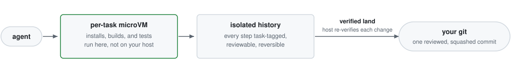

<p align="center">
  <h1 align="center">mgit</h1>
  <p align="center">
    <strong>Sandboxed version control for autonomous coding agents.</strong>
  </p>
  <p align="center">
    <sub>Part of the <a href="https://github.com/hyper-swe">HyperSwe</a> suite.</sub>
  </p>
  <p align="center">
    <a href="https://github.com/hyper-swe/mgit/releases"></a>
    <a href="https://github.com/hyper-swe/mgit/actions/workflows/ci.yml"></a>
    <a href="go.mod"></a>
    <a href="LICENSE"></a>
    
  </p>
</p>

**mgit is a sandboxed, version-controlled workspace for autonomous coding agents.** It runs an agent's untrusted code (dependency installs, builds, and tests) in a disposable per-task microVM, and records the agent's work in an isolated, append-only store separate from the project's git. Each change is tagged to the task that produced it, and only the reviewed, squashed result is landed into the repository.

Coding agents increasingly run unattended, installing packages and executing build and test commands as they iterate. mgit makes that safe on a real codebase: execution is contained to a throwaway VM with access limited to what the task needs, the project's git is never modified directly, and every step the agent takes is preserved as a traceable, reviewable record.

<p align="center">
  <picture>
    <source media="(prefers-color-scheme: dark)" srcset="docs/assets/containment-flow-dark.svg">
    
  </picture>
</p>

### What you get

- 🛡️ **Sandboxed execution**: installs, builds, and tests run in an isolated VM, never on the host.
- 🔒 **Default-deny networking**: the agent reaches only what the task needs; your secrets and network stay unreachable.
- ✅ **Verified land**: only changes that pass host-side re-verification (dual-hash, task binding, host-anchored attestation) reach your repo.
- 🧬 **Isolated, clean history**: intermediate work stays in mgit's own store; only the squashed result lands in your git, and you can roll back or branch from any step.
- 📜 **An audit trail you can stand behind**: append-only, task-tagged, dual-hash-verified history; trace any landed change back to the task, the agent, and every step that produced it.
- 🤝 **Multi-agent parallelism**: per-task worktrees and per-task sandboxes let agents work different tasks side by side without collisions.
- 🔌 **Fits what you have**: runs over your existing git repo without touching `.git`, stays in sync with it automatically, and wires into Claude Code, Codex, and Cursor with one command.

> *"Six tickets, zero conflicts, and `squash --to-git` round-trips byte-for-byte. The microVM sandbox is the one capability plain git worktrees fundamentally lack."*
> <br><sub>Independent team that integrated their own project through mgit</sub>

## Quick start

Two minutes, on top of your existing repo. Nothing to migrate; your git is left untouched.

Install (macOS / Linux):

```bash
curl -fsSL https://raw.githubusercontent.com/hyper-swe/mgit/main/install.sh | sh
```

or with Homebrew, or Go:

```bash
brew install hyper-swe/tap/mgit
go install github.com/hyper-swe/mgit/cmd/mgit@latest
```

Start an agent on a task. `mgit work` provisions a task-bound worktree and wires the agent's harness; with `--sandbox` it also launches the task's microVM. The `--sandbox` leg requires [enabling the sandbox](#enable-the-sandbox) first (the daemon and a guest base); everything else in this walkthrough works without it.

```bash
mgit init                                    # set mgit up alongside your existing git repo
mgit work ./wt-PROJ-12 --task-id PROJ-12 \
  --sandbox --image base@sha256:<hex> --network allowlist --allow registry.npmjs.org
```

Inside that worktree, the agent's commands execute in the guest VM, and each coherent step becomes a task-tagged micro-commit:

```bash
cd ./wt-PROJ-12
mgit run -- npm install                 # runs in the microVM, never on the host (fail-closed)
mgit commit -m "add validation helper"  # task ID auto-inherited from the worktree
mgit run -- npm test
mgit commit -m "wire validation into handler"
```

Review, squash, and land:

```bash
mgit log --task-id PROJ-12 --oneline    # the step-by-step history is the review surface
mgit diff --task-id PROJ-12
mgit squash --task-id PROJ-12           # one reviewable commit for the whole task
mgit sandbox land --task-id PROJ-12     # host-verify and append into your real repo
```

If a decision turns out wrong mid-task, [backtrack, fork, and salvage](#course-correction-a-checkpointed-working-substrate) instead of rewriting from scratch. Agent harnesses (Claude Code, Codex, Cursor) are wired automatically by `mgit work`, so all of this is transparent to the agent.

> **Worktree notes.** An mgit worktree is **not** a git repo (no `.git`); integrate by exporting the squash as a patch (`mgit squash --task-id <ID> --to-git | git apply`), never by running `git` inside the worktree. Gitignored build artifacts (e.g. an embedded `web/dist`) are not seeded into worktrees; list them in `.mgit/seed-include` (one glob per line) to carry them in.

<p align="center">
  <a href="#why-this-exists">Why</a> &middot;
  <a href="#how-containment-works">Containment</a> &middot;
  <a href="#course-correction-a-checkpointed-working-substrate">Course-correction</a> &middot;
  <a href="#an-audit-trail-for-agent-work">Audit</a> &middot;
  <a href="#installation">Install</a> &middot;
  <a href="#commands">Commands</a> &middot;
  <a href="#security-model">Security</a> &middot;
  <a href="#scope-and-current-status">Scope</a>
</p>

---

## Why this exists

An autonomous agent working a task routinely executes code no one has read: a single `npm install` runs the install hooks of hundreds of transitive dependencies, and supply-chain attacks on public registries are reported weekly. When the agent runs directly on your machine, that code runs with your privileges, alongside your credentials and every other repository you have, and there is no version control for a leaked key. Containment has to happen before execution, not after.

mgit provides that containment, and pairs it with a working history built for how agents actually work: many small steps, some of them wrong, that need to stay reviewable and reversible without polluting the project's git.

## How containment works

mgit runs the agent's untrusted execution inside a **per-task microVM** (Firecracker on Linux/KVM; Apple Virtualization.framework on macOS, running a Linux guest), so the blast radius of a compromised package is a disposable VM, not your host:

- **Hardware-isolated execution.** Installs, builds, and tests run in the guest VM. The host filesystem, your other repos, and your credentials are never mounted in. The microVM boundary is the same one cloud providers trust to isolate tenants.
- **Default-deny egress.** The guest gets no direct network route. A per-task allowlist permits only the destinations a task actually needs (e.g. your package registry), enforced at the IP/flow layer by a host-side proxy. Raw-IP, QUIC, DNS-tunnelling, and metadata-endpoint tricks are denied. (`none` / `allowlist` / `open` modes.)
- **A verified airlock back to your repo.** The agent commits inside the sandbox; only its changes are pulled back over a dedicated channel, re-verified host-side (dual-hash, task binding, and a host-anchored attestation the guest cannot forge), and appended to your real repository. Nothing the guest produces reaches your repo unverified.
- **Fail-closed routing.** `mgit run -- <command>` transparently routes the agent's execution into the task's sandbox; if the sandbox is unavailable it fails closed and never silently runs on the host.

This is mgit's first job: make running agents in auto mode safe by default. The version-control layer below is the airlock that lets contained work flow back out cleanly. The isolation boundary has been adversarially audited; see [Security model](#security-model).

## Course-correction: a checkpointed working substrate

Contained execution gets work *in* safely. The other half is giving the agent a place to **work** that keeps your real repo clean and lets you undo a wrong decision without throwing away the good work around it.

Instead of crowding your git history with agent micro-commit noise, the agent commits each small, coherent step into an **isolated `.mgit` store**, a self-contained go-git repository that provably never touches your project's `.git`. That gives you a checkpointed timeline of the agent's reasoning that you can rewind, fork, and salvage from:

```
mgit work -> commit -> commit -> commit -> (wrong lib chosen) -> commit
                          \                        |
                           \                       +-- rollback: revert the wrong step (append-only)
                            \                              |
                             \                             +-- checkout -b: fork a new line, continue the right way
                              \                                          |
                               +-- restore the good bits from -----------+
                                   any earlier checkpoint
                                   (the old line stays preserved in history)
                                                  |
                                                  +-- squash -> land only the reviewed result
```

When a decision turns out wrong, you don't reprompt the agent to rewrite hundreds of lines from scratch:

1. **Backtrack**: `mgit rollback` reverts the wrong step's task as a new commit and restores the pre-task state in your working tree; nothing is deleted, and the wrong attempt stays in the history.
2. **Fork**: `mgit checkout -b` opens a new line, preserving the old attempt.
3. **Salvage**: `mgit restore --all --commit <hash>` returns the whole tree to any checkpoint (or a single file without `--all`), and `mgit cherry-pick` applies a still-good step from the old line, content and provenance both.
4. **Squash**: the corrected micro-commits land as one reviewable commit.

Micro-granularity earns its keep *in-task* (cheap course-correction plus a fine-grained review surface); the landed artifact is the squashed result. **You can always see and undo exactly what the agent did**: every step, including the abandoned line, stays in an append-only history for review.

## An audit trail for agent work

When an agent's change breaks something weeks later, `git blame` tells you which commit; mgit tells you the story behind it. The store is append-only (rollbacks create revert commits, nothing is ever deleted), every commit carries its task and agent identity, and integrity is dual-hashed (SHA-1 for git compatibility, SHA-256 for tamper detection):

```bash
mgit audit --task-id PROJ-12     # who did what, when, in order (including rollbacks)
mgit log --task-id PROJ-12       # every micro-step behind the landed commit
mgit verify --task-id PROJ-12    # prove the recorded chain has not been tampered with
```

That turns incident forensics from archaeology into a query: trace a landed commit back to its task, the agent that worked it, and every intermediate step including abandoned attempts; scope a regression's blast radius by asking what else that task touched. The trail is available for as long as the `.mgit` store is retained alongside the repo, which is how HyperSwe deployments run it.

### The trail says whether it *is* a trail

A list of commits looks like a list of steps, and often is not. Measured across six real agent runs on mgit's own repo, agents treat `mgit commit` as a final packaging step rather than a checkpoint: one task's six commits were all written in the last five minutes of a forty-minute run, thirteen seconds apart. Read as six steps, they are one step split six ways after the fact.

So `mgit log --task-id` reports what it can actually know — when the work was recorded, against when the task's worktree was created — and labels the trail accordingly:

```
cadence: PACKAGED_POST_HOC
  6 commits written over 4m41s of a 39m46s run (12% of it). This trail was packaged
  post-hoc; it is not process history. Read it as one step recorded in 6 parts.
  measured 2026-08-12T12:23:40Z to 2026-08-12T12:28:21Z, from the worktree created
  at 2026-08-12T11:48:35Z [WORKTREE_CREATED_TO_LAST_COMMIT]
```

A manufactured trail is the rarer problem, though. Across those six runs, one was packaged post-hoc, two were genuinely spread, two recorded a single commit and one recorded nothing at all — half of them left no process history whatever. One commit closing a 33-minute run gets its own verdict, `SINGLE_CHECKPOINT`, because that is a complete observation rather than a failed measurement: the record holds a result, with no earlier point in the run to return to.

The verdict token is stable and machine-readable (`cadence.verdict` under `--json`); the prose is not. When the *run* cannot be measured — no registered worktree, a worktree reused across sessions, commits older than the worktree holding them, a run too short to read anything into — it says `INSUFFICIENT_EVIDENCE` and why, never a default of "fine". It is evidence, not a score: nothing gates on it, deliberately, because an agent committing to satisfy a checker manufactures the very trail the label exists to expose.

## Installation

**Install script** (macOS / Linux) — the recommended path:

```bash
curl -fsSL https://raw.githubusercontent.com/hyper-swe/mgit/main/install.sh | sh
```

It resolves the latest release, **verifies the download against the published `checksums.txt`** before installing anything, and places `mgit`, `mgit-sandboxd` and the guest pair in the layout mgit expects. Pin a version with `MGIT_VERSION=v0.4.3`, or choose where it lands with `MGIT_PREFIX=$HOME/.local` (the default is `/usr/local` when writable, otherwise `~/.local`).

It also sidesteps a macOS trap that a browser download cannot: see [Why not just download the archive?](#why-not-just-download-the-archive) below.

**Homebrew** (macOS / Linux):

```bash
brew install hyper-swe/tap/mgit
```

One command, no other taps and no `brew trust` — the [sandbox](#enable-the-sandbox) layer has its own prerequisites, and none of them are needed to install or use core mgit.

**Go**:

```bash
go install github.com/hyper-swe/mgit/cmd/mgit@latest
```

**From source**:

```bash
git clone https://github.com/hyper-swe/mgit.git && cd mgit && make build
```

**Binary releases**: pre-built binaries for Linux, macOS, and Windows (amd64 and arm64) are on [GitHub Releases](https://github.com/hyper-swe/mgit/releases). On macOS, read the next section first.

### Why not just download the archive?

On macOS you can, but on Apple Silicon it will not run until you clear one attribute — and the reason is worth understanding, because it is not a bug in the binary.

A **browser** download writes `com.apple.quarantine` onto the file, and Gatekeeper SIGKILLs a quarantined ad-hoc-signed binary outright: no dialog, just `zsh: killed`, or a "cannot verify this app is free of malware" alert. Both `mgit` and `mgit-sandboxd` are affected, and the attribute survives extraction — measured: a quarantined `.tar.gz` produces quarantined binaries even through command-line `tar`.

The attribute is written by the **downloading app on your machine**, so nothing we do when building the release can remove it. Only Apple notarization (a paid Developer ID certificate) fixes the browser path, and mgit is ad-hoc signed today.

What that means in practice:

| How you get it | Quarantined? |
|---|---|
| `install.sh` (curl) | **No** — curl is not a quarantine-aware app |
| Homebrew | **No** |
| `go install` / from source | **No** |
| Browser download from the Releases page | **Yes** — killed until you clear it |

So prefer the install script or Homebrew. If you did download through a browser:

```bash
xattr -d com.apple.quarantine mgit mgit-sandboxd
```

That fully resolves it — the binaries themselves are fine. Refs: [docs/INSTALL-SANDBOX.md](docs/INSTALL-SANDBOX.md#release-archive), MGIT-64.

Everything above installs the `mgit` binary, which is all you need for the version-control workflow: init, worktrees, commit, log, squash, and landing by patch. The microVM sandbox (`mgit run`, `mgit work --sandbox`) is a separate, optional layer with its own prerequisites.

### Enable the sandbox

#### Which backend — this decides what your agent loop can do

The two GA backends deliver the worktree differently, and the difference is
visible to an agent loop rather than an implementation detail:

| | macOS / libkrun | Linux / firecracker | Linux / libkrun (`-tags libkrun`) |
|---|---|---|---|
| launch, exec, land | ✅ live-validated | ✅ live-validated (CI-gated) | ✅ live-validated (CI-gated) |
| hostile-guest containment (SEC-03) | ✅ | ✅ | ✅ |
| guest networking + live egress policy | ✅ | ✅ | ✅ live-validated (CI-gated) |
| guest can write outside `/tmp`, `/etc` and its worktree | ✅ | ✅ | ❌ (upstream, MGIT-89) |
| host edits reach a **running** guest (`sandbox sync`) | ✅ | ❌ refused | ✅ live-validated (CI-gated) |
| artifact export (`sandbox export`) | ✅ | ❌ refused | ✅ |
| the VM dies with a **crashed** daemon (`kill -9`) | ✅ live-validated | ✅ CI-gated | ✅ live-validated |

firecracker packs the worktree into an ext4 image at launch and the guest
mounts it, so there is no host directory to re-stage into or read out of. Both
refusals fail closed and name the backend — nothing silently no-ops.

**A daemon that dies takes its microVMs with it**, on every exit path rather
than only the orderly ones. Ordinary exits (idle timeout, SIGINT, SIGTERM)
drain: each sandbox is stopped and removed. The ungraceful ones — SIGKILL, an
OOM kill, a crash — run no code at all, so the guarantee has to come from the
kernel. libkrun's VM child holds a *lifeline* descriptor whose other end the
daemon owns; the kernel closes it when the daemon dies, and the child ends the
VM. firecracker's VMM, a foreign binary that watches nothing, is given
`PR_SET_PDEATHSIG` from a pinned forking thread instead. Both are asserted with
a real booted VM and a process count in
`scripts/e2e/sandbox_registry_durability.sh`. The `--backend container`
fallback is **not** covered: podman owns those containers' lifetime, not mgit.

**What that means in practice.** If your loop edits the host worktree between
rounds — the usual shape for an agent that reviews, fixes and re-tests — every
exec after launch on firecracker runs against the launch-time copy. Relaunching
per round restores correctness but destroys the provisioned environment, which
is the cost `sandbox policy` exists to avoid. **Use libkrun for that loop.** If
each round is a fresh sandbox, or work only crosses back via `land`, firecracker
is fine.

**On Linux, no single backend does everything**, and which one you want is
decided by the loop rather than by preference. Linux libkrun boots real microVMs
and runs the containment, sync and export suites on real KVM — validated and
CI-gated as of MGIT-87, superseding the older "never validated end to end"
caveat, and MGIT-89/90/91 closed the gaps that validation found. Two residuals
do not carry over from macOS, both measured on real hardware and both upstream:

- **The guest cannot write most of its image root.** `/tmp`, `/etc` and the
  mounted worktree are writable; anything else under `/` fails with `operation
  not supported`, so an agent can build and commit but cannot `apt install`.
  The cause is upstream and precise: libkrun's Linux virtio-fs answers
  `FS_IOC_GETFLAGS` with `EOPNOTSUPP`, and overlayfs propagates exactly that
  errno out of every copy-up (it tolerates only `ENOTTY`/`EINVAL`). macOS
  libkrun answers `ENOTTY` on the same call, which is the whole difference.
  Tracked as MGIT-89; `/etc` is writable because mgit-guest detects the
  refusal and shadows it with a seeded tmpfs, which is what lets a networked
  guest start at all.
- **A deleted path can stay *visible* to the guest for a few seconds**, though
  never *readable*: libkrun's Linux virtio-fs caches name lookups for ~5s
  (macOS measures 0s), so a guest process that already resolved a path may keep
  resolving it after the sync removes it. mgit empties a file before unlinking
  it, so what lingers is an empty name, never deleted content — a build reading
  it fails loudly instead of silently compiling code you deleted. Creations and
  content edits are visible immediately.

So on Linux, **libkrun now does the whole loop**: guest egress with live
policy, host edits re-staged into a long-lived guest, and artifacts read back
out. That combination had no backend at all before MGIT-89. firecracker remains the choice when the agent must write
freely across the image root (`apt install`), which libkrun cannot do here.
The capability set above is exactly what CI asserts on every push, named test
by test in `scripts/e2e/libkrun_linux_column.sh`.

The sandbox needs a second host binary, `mgit-sandboxd`, and a guest base. On Linux and macOS arm64, Homebrew and the release archives install `mgit-sandboxd` next to `mgit` automatically; you can also `go install github.com/hyper-swe/mgit/cmd/mgit-sandboxd@latest`.

- **macOS** requires Apple Silicon (arm64), macOS 14+, and the **libkrun** hypervisor, which is *not* installed with mgit — it lives in a third-party Homebrew tap, and Homebrew will not load a formula from a tap you have not trusted. All three commands are needed, in this order:

  ```bash
  brew tap libkrun/krun
  brew trust libkrun/krun
  brew install libkrun
  ```

  `brew install libkrun` on its own fails, and so does the fully-qualified name — see [docs/INSTALL-SANDBOX.md](docs/INSTALL-SANDBOX.md#installing-libkrun-on-macos) for why, and for why mgit no longer tries to install it for you. The release/brew daemon links libkrun and is code-signed with the hypervisor entitlement (a `go install`-ed daemon is unsigned and must be signed locally).
- **Linux** requires KVM (`/dev/kvm`) and the `firecracker` binary on `PATH`.
- **Windows and Intel macOS** have no sandbox backend yet; core mgit runs without it.

Skipping the hypervisor step degrades nothing silently: the daemon refuses to start, and `mgit` reports the missing library together with the commands that fix it.

Then compose the Linux userspace the VM boots — from any public OCI image, pulled straight from its registry with no Docker and no container runtime:

```bash
mgit sandbox image init                # once per repo: create the signing trust root
mgit sandbox base from debian:12       # or node:22, python:3.12, golang:1.23 …
```

That pulls the image, injects `mgit` and `mgit-guest`, pins the composed tree by content digest and signs it into your repo's trust root. `mgit run` and `mgit work --sandbox` use it automatically from then on.

**Pick the image your task's toolchain needs** — the base *is* the environment your agent works in. mgit ships no default base: it redistributes no kernel and no userspace, and with none registered a launch fails closed naming the command above rather than booting something you never chose. Choosing the contents is safe precisely because the guest is the untrusted side: a poisoned base burns a throwaway VM, while the store quarantine, egress policy, land airlock and attestation signing are all enforced host-side.

The full walkthrough, platform prerequisites, the kernel+rootfs path used by the firecracker backend, and the trust model are in [docs/INSTALL-SANDBOX.md](docs/INSTALL-SANDBOX.md).

**Without the sandbox**, mgit is still a complete checkpointed working substrate. `mgit run` and `mgit sandbox land` are the only sandbox-gated commands; integrate a task's result by exporting its squash as a patch and applying it to your git:

```bash
mgit squash --task-id PROJ-12 --to-git | git apply   # or: git am
```

## Commands

The everyday surface:

| Command | Description |
|---------|-------------|
| `mgit init` | Set mgit up alongside your existing git repo |
| `mgit work PATH --task-id ID [--sandbox]` | Start an agent on a task: worktree + agent wiring + optional microVM |
| `mgit run -- <command>` | Run a command in the task's microVM (fail-closed; never on the host) |
| `mgit commit -m MSG` | Create a task-tagged micro-commit (task ID auto-inherited in a worktree); `-F FILE` (or `-F -` for stdin) reads the message verbatim, with no shell in the way |
| `mgit log --task-id ID` | View a task's step-by-step history, with the evidence label saying whether it *is* one |
| `mgit rollback --task-id ID [--commit HASH]` | Revert a task: an append-only revert commit that also restores the working tree |
| `mgit audit --task-id ID` | Replay who did what, when, from the append-only audit trail |
| `mgit squash --task-id ID [--to-git]` | Consolidate a task's micro-commits into one reviewable commit |
| `mgit sandbox land --task-id ID` | Pull, host-verify, and land the sandbox's changes into your repo |

All commands support `--json` for structured output. `mgit run` and `mgit sandbox land` are the only sandbox-gated commands; see [Enable the sandbox](#enable-the-sandbox). Without a sandbox, land a task with `mgit squash --task-id ID --to-git | git apply`.

<details>
<summary><strong>Core</strong> (init, commit, log, status, show, branch, config)</summary>

| Command | Description |
|---------|-------------|
| `mgit init` | Initialize a new mgit repository |
| `mgit commit --task-id ID` | Create a task-tagged micro-commit (`-m MSG` inline, or `-F FILE` / `-F -` to read the message verbatim from a file or stdin) |
| `mgit log [--task-id ID]` | View commit history, optionally filtered by task |
| `mgit status` | Show working tree status |
| `mgit show HASH` | Display commit details |
| `mgit branch --task-id ID` | Create a task branch |
| `mgit branch` | List all branches |
| `mgit config get/set/list` | Manage configuration |

</details>

<details>
<summary><strong>Workflows</strong> (squash, rollback, verify, audit, export)</summary>

| Command | Description |
|---------|-------------|
| `mgit squash --task-id ID [--to-git \| --to-main]` | Consolidate micro-commits into one |
| `mgit rollback --task-id ID [--commit HASH]` | Revert a task: an append-only revert commit that also restores the working tree (a step's hash resolves its task) |
| `mgit verify [--task-id ID] [--fix]` | Verify commit chain and index integrity |
| `mgit audit [--task-id ID] [--since --until]` | View the audit trail |
| `mgit export --task-id ID --format json\|git\|audit-log` | Export task data. A pure read: creates no squash commit, writes no audit record. `--format git` yields the same hunks as `squash --to-git`; a task whose net change is genuinely empty prints an explanatory note on stderr and no patch, rather than an empty one |

</details>

<details>
<summary><strong>Multi-agent</strong> (work, worktree)</summary>

| Command | Description |
|---------|-------------|
| `mgit work PATH --task-id ID [--sandbox]` | Start an agent on a task: task-bound worktree + agent-shell wiring + optional sandbox |
| `mgit worktree add PATH --task-id ID [--branch]` | Create an isolated worktree without the agent-shell wiring |
| `mgit worktree list [--porcelain]` | List active worktrees |
| `mgit worktree remove PATH [--force]` | Remove a worktree |
| `mgit worktree prune [--dry-run]` | Remove stale worktree metadata |

</details>

<details>
<summary><strong>Sandbox / agent execution</strong> (run, sandbox launch/exec/shell/land/sync/grants/image)</summary>

| Command | Description |
|---------|-------------|
| `mgit run -- <command>` | Run a command inside the current worktree's task microVM (fail-closed) |
| `mgit sandbox launch --task-id ID --worktree PATH --image REF` | Register a sandbox for a task (the microVM boots on first use, and fails closed if its guest never comes up) |
| `… --cpus N --memory-mb N --disk-quota-mb N` | Size this sandbox (also on `mgit work`). Unset takes the host policy default; above the policy's per-sandbox maximum the launch is **refused naming the limit**, never silently reduced |
| `mgit sandbox exec --task-id ID -- <command>` | Execute one command in the task's sandbox |
| `mgit sandbox shell --task-id ID` | Attach an interactive session (confined-agent mode) |
| `mgit sandbox land --task-id ID` | Pull + host-verify + land the sandbox's changes |
| `mgit sandbox sync --task-id ID [--dry-run] [--force]` | Re-stage the host worktree into the running guest; `--dry-run` reports what would change (and every conflict) without touching it |
| `mgit sandbox status ID` / `list` / `remove ID` | Inspect or tear down sandboxes |
| `mgit sandbox grants --task-id ID` / `grant --task-id ID KEY` | Review and approve per-task egress requests |
| `mgit sandbox policy set/revoke/show --task-id ID` | Change or read a sandbox's egress allowlist without relaunching it. Works **before first boot** too — see below |
| `mgit sandbox base from <oci-image>` / `set <dir>` | Compose this repo's guest base from an OCI image, or use a tree you built |
| `mgit sandbox image init` / `add --kernel … --rootfs …` | Manage the signed, digest-pinned image set (firecracker kernel + rootfs) |

Sandbox commands require the host daemon and a guest base, and run on macOS (libkrun, Apple Silicon) and Linux (firecracker/KVM).

**Egress policy before the microVM boots.** Provisioning is lazy: `mgit work --sandbox` and `mgit sandbox launch` *register* a sandbox and the microVM starts on first use. `mgit sandbox policy set/revoke` work at that point too — the policy is **staged onto the pending launch**, so the VM comes up already enforcing it and never runs under the policy you were replacing, not even for the instant between boot and mutation. `policy show` reports a staged policy as `PENDING`, never as one in force: *"is being enforced"* and *"will be enforced once something starts"* are different facts, and a caller who confuses them runs untrusted code believing a line is being held that nothing is holding yet. Once the VM is up, the same verbs mutate the live enforcer and `show` reads back from it.

**Failure codes are a stable contract.** Every failure of `policy set`, `policy revoke` and `policy show` carries a machine-readable token — as `error_code` in `--json` output, and in square brackets at the start of the human message. **Match on the token, never on the wording**, which will keep changing:

| Token | What it means | Remedy |
|---|---|---|
| `NOT_BOOTED` | The sandbox is registered but its microVM has not booted; nothing is enforcing egress for it yet | Normally not an error at all — `policy set` stages instead. It appears when the staging itself failed |
| `BOOTED_DIED` | Recorded as running, but its enforcer is not answering: the guest exited or was killed | `mgit sandbox remove --task <ID>`, then re-run the task |
| `VERSION_PREDATES` | Its VM was launched without a control channel by an older build; the launch-time allowlist still stands and cannot be changed in place | Relaunch it with this build |
| `UNKNOWN` | Anything this build cannot classify | Read the message |

The set is **closed**, and an unrecognized cause gets `UNKNOWN` rather than the nearest of the other three — a confident wrong answer is worse than an admitted one. Every one of these failures leaves the policy **unchanged**: an unreachable enforcer is an error, never an empty policy, because an empty list reads as "nothing is allowed" when the truth may be "nothing is enforcing".

**Sizing a guest.** A sandbox's CPU/memory/disk are declared by the workload and bounded by the operator: `--memory-mb` on `mgit work` or `mgit sandbox launch` asks for a size, and the host policy's `max_memory_mb` / `max_cpus` / `max_disk_quota_mb` bound what may be asked for. mgit **refuses** an over-large request naming that limit rather than clamping it — a caller that silently receives less than it asked for concludes its workload is at fault and reshapes it, which is exactly the failure this surface exists to prevent. The fleet-wide FR-17.26 ceiling applies on top and its refusal reads differently ("the host is already running N sandboxes"): a launch can be individually legal and still refused because the host is full. `mgit sandbox status <task>` reports the effective caps, and the generated CLAUDE.md states them to the agent.

**Bounding the whole fleet.** The per-sandbox maxima above bound one launch; the FR-17.26 aggregate ceiling bounds all of them at once, and it is live in a default install with no operator flag. `mgit-sandboxd` resolves host policy's `max_total_memory_percent` (default **50**) against the host's measured physical memory at startup and states the result on its log (`event=fleet_memory_ceiling`), alongside `max_concurrent_sandboxes` (default 8). `--max-memory-mb` remains as an explicit operator override — useful where the host probe overstates the daemon's real budget, such as inside a cgroup memory limit. If host memory cannot be measured at all, the daemon falls back to a conservative absolute (4096 MB) and says so; it never falls back to "no ceiling", and it never refuses to start over an unreadable probe or policy file. The ceiling counts **admitted** memory — what each sandbox declared — not resident memory, because libkrun and firecracker allocate guest pages lazily; that errs toward under-admitting rather than over-committing, but it is not a measurement of live host pressure.

On a small host, 50% of physical memory can land *below* the 2048 MB per-sandbox default, so every launch is refused. mgit keeps the operator's stated percentage rather than quietly raising the ceiling to fit one sandbox, and explains itself twice instead: a startup warning naming the host as too small for the policy in force, and a launch refusal saying the request "cannot be admitted even on a completely idle host" that points at `max_total_memory_percent` rather than at freeing capacity — advice that could never work.

The guest's worktree is a **staged copy**, not a live view of yours — that is what lets mgit exclude an in-worktree `.git`/`.mgit` and reject an escaping symlink host-side, before the guest can act on them. Host edits therefore reach a running guest by re-staging: automatically before each `exec`, or on demand with `mgit sandbox sync`. Paths the guest changed since they were delivered are a conflict; the sync is refused entirely and names them, and `--force` overwrites them and reports each one destroyed. Files the guest created itself (`node_modules`, build caches) are never touched. A sandbox whose worktree was delivered as a launch-time image (firecracker) cannot be synced and says so — re-launch it to pick up host changes.

</details>

<details>
<summary><strong>Additional</strong> (add, diff, checkout, merge, cherry-pick, restore, gc, import, docs)</summary>

| Command | Description |
|---------|-------------|
| `mgit add [files...] [--all]` | Stage files |
| `mgit diff [--from --to \| --task-id \| --staged]` | Show differences between commits, tasks, or staged files |
| `mgit checkout BRANCH` | Switch branches (blocks on uncommitted changes) |
| `mgit merge BRANCH [--squash \| --no-ff]` | Merge with fast-forward, squash, or no-ff strategy |
| `mgit cherry-pick HASH [--no-commit \| --onto]` | Apply a commit's changes to the current or target branch (conflict-safe, provenance-tagged) |
| `mgit restore [FILE] --commit HASH [--all]` | Restore a file, or with `--all` the whole working tree, from a checkpoint commit |
| `mgit gc [--aggressive]` | Pack loose objects and report space saved |
| `mgit import --file BUNDLE [--mode merge\|replace]` | Import a bundle with SHA-256 manifest verification |
| `mgit docs generate` | Generate agent-facing documentation |

</details>

## MCP and REST integration

mgit exposes 15 MCP tools for direct use by LLM coding agents (`mgit_commit`, `mgit_log`, `mgit_status`, `mgit_diff`, `mgit_squash`, `mgit_rollback`, `mgit_verify`, `mgit_audit`, `mgit_config`, `mgit_worktree_add/list/remove`, and more). Each tool delegates to the same service layer as the CLI, so semantics, validation, and the append-only audit guarantee are identical. The MCP server is `mgit serve --mcp-only` (stdio). It serves the current directory's repo by default, or the one given by `--project <path>` (use `--project` when the harness launches the server from an arbitrary working directory, e.g. the Claude desktop app):

```bash
# Claude Code (run from your project directory)
claude mcp add mgit -- mgit serve --mcp-only
```

```json
// Cursor (.cursor/mcp.json)
{ "mcpServers": { "mgit": { "command": "mgit", "args": ["serve", "--mcp-only"] } } }
```

```json
// Claude desktop app (claude_desktop_config.json): pin the project explicitly
{ "mcpServers": { "mgit": { "command": "mgit", "args": ["serve", "--mcp-only", "--project", "/absolute/path/to/your/project"] } } }
```

A REST API (`mgit serve`) covers a deliberately minimal subset for same-host service integration: commits, branches, squash, rollback, and verify under `/api/v1/`. It always binds `127.0.0.1` and is unauthenticated by design; the trust model is same-user local processes, the same trust as running the CLI. The full parity matrix, including the formal REST scope decision, is in [docs/MCP-PARITY.md](docs/MCP-PARITY.md).

> A long-running `mgit serve` no longer blocks the CLI: it takes the repo lock only for the duration of each operation, so an agent driving mgit over MCP and a human using the CLI can work the same repo at once.

## mgit + mtix: a closed loop for AI coding

mgit pairs with [mtix](https://github.com/hyper-swe/mtix), an AI-native micro issue manager. Together they answer the two questions that matter for agent-driven development:

- **mtix**: *what was supposed to happen?* (the task, the acceptance criteria, who claimed it)
- **mgit**: *what actually happened?* (the commits, the diffs, the agent, the timestamps)

Task IDs flow between both systems: mtix decomposes a feature into micro-tasks, an agent claims one, mgit records every step as task-tagged commits, and when mtix marks the task done, mgit auto-squashes the work into a single reviewable commit. If a task went wrong, you roll back *that task*, and other tasks on the branch keep their work intact. **The unit of failure is a task, not a session.**

```bash
mtix ready                                 # 1. find work
mtix claim PROJ-4.2.1 --agent=claude-01    # 2. claim a task
mgit commit --task-id PROJ-4.2.1 -m "add validation"   # 3. task-tagged steps
mtix done PROJ-4.2.1                       # 4. done in mtix triggers mgit auto-squash
```

The result is requirement-to-commit traceability: not *"the AI did some work"* but *"agent claude-01 implemented PROJ-4.2.1 across these 7 commits, squashed at this timestamp, verified by chain hash X."*

## Security model

mgit's sandbox is designed around one premise: **the guest is the hostile party**. It runs the untrusted dependency code, so nothing it produces or asserts is trusted. The host is the trust anchor, and every guarantee is enforced host-side at the four places host and guest meet:

| Seam | Control |
|------|---------|
| **Execution boundary** | Per-task microVM (Firecracker / Virtualization.framework). Untrusted installs/builds/tests run in the guest; the host disk and credentials are never mounted in. |
| **Network egress** | Default-deny at the IP/flow layer. Per-task allowlist via a host proxy + restricted DNS; RFC1918, link-local, and cloud-metadata destinations denied unconditionally; UDP/QUIC blocked. |
| **Worktree mount** | The guest sees working-tree files only; the host's shared object store, index, and other tasks' data are not part of the guest view. |
| **Land / attestation** | Commits are re-verified host-side (dual-hash + task binding) and carry a **host-anchored attestation**: the guest holds no signing key and cannot forge provenance. Land is the only path from the guest's private store to your repo, and it is append-only. |

Additional properties: the guest base is digest-pinned **and** Ed25519-signature-verified at boot; capability escalations (extra egress) are derived only from the host-observed denied connection, scoped to the sandbox lifetime, and audited (there is no "allow all"); the local daemon socket is same-UID peer-credential authenticated; a global concurrency + memory ceiling bounds host resource use.

This model has been **adversarially audited**: a red-team design audit plus an independent story-closure code review against each control, with the audit anchors checked into the repo ([`AUDIT-FR17-SANDBOX-V1.md`](AUDIT-FR17-SANDBOX-V1.md), [`AUDIT-FR17-SANDBOX-SECURITY-V1.md`](AUDIT-FR17-SANDBOX-SECURITY-V1.md)). The hardware-isolation boundary is the load-bearing guarantee; the seam-level defenses are under continuous, independently-reviewed hardening, and open findings are treated as release-gating.

## Scope and current status

mgit is in beta, and this section states plainly what is and is not there yet.

- **Sandbox platforms.** The microVM sandbox ships for Linux (Firecracker/KVM) and macOS, where the default profile runs a **Linux guest** under Apple Virtualization.framework (the right fit for Linux and cross-platform workloads). A mac-native profile for Swift/Xcode/Homebrew workloads is a planned opt-in. On Windows, mgit's core version control runs without the sandbox until the native backend lands.
- **What mgit is underneath.** mgit is git (go-git) plus an isolated store; the value is the agent workflow and the sandbox-to-land integration, not novel storage. The closest alternative is "git + a scratch-branch convention."
- **Course-correction maturity.** The backtrack/fork/salvage loop is content-restoring (rollback and restore recover working-tree state, cherry-pick applies real changes, all conflict-safe), e2e-tested, and instructed in the agent skills, but autonomous use by agents has not yet been validated head-to-head. Today the most reliable actor directing course-correction is a reviewer reading the history.
- **When plain git worktrees are enough.** If you push WIP freely and your agent runs only trusted code, native `git worktree` is lighter and git-native. mgit earns its keep when you can't or won't push WIP (an mgit worktree carries your unpushed local state), when you want a task-to-commit audit trail, and above all when the agent runs untrusted code, which is the capability plain worktrees fundamentally lack.

## Architecture

```
                    +-----------+
                    |  CLI (22) |
                    +-----+-----+
                          |
            +-------------+-------------+
            |                           |
      +-----+------+          +--------+--------+
      | REST API   |          | MCP Server (15) |
      | (10 routes)|          | (stdio/SSE)     |
      +-----+------+          +--------+--------+
            |                           |
            +-------------+-------------+
                          |
                 +--------+--------+
                 |  Service Layer  |
                 |  (13 services)  |
                 +--------+--------+
                          |
              +-----------+-----------+
              |                       |
       +------+------+        +------+------+
       |   go-git    |        |   SQLite    |
       |   Store     |        |   Index     |
       +------+------+        +------+------+
              |                       |
         .mgit/objects           .mgit/index.db
         .mgit/refs
```

- **Layered architecture**: CLI/API/MCP call services; services call stores; stores manage go-git and SQLite. No layer skipping.
- **Append-only**: the `task_commits` table and audit log are insert-only. Rollbacks create new commits, never delete.
- **Dual-hash integrity**: SHA-1 for git protocol compatibility, SHA-256 for content verification and tamper detection.
- **Git-authoritative coexistence**: mgit keeps its `.mgit` base coherent with your local git state automatically (no manual sync); each task pins the base it forked from so a later resync never corrupts its diff ([ADR-008](docs/adr/008-git-authoritative-coexistence.md)).
- **Pure-Go core**: no CGO, no external git binary. Single static binary, cross-compiles to 6 platforms. The sandbox runs as a separate privileged host daemon (`mgit-sandboxd`); any platform CGO is confined there.

Benchmarked on Apple M5: commit 0.39ms, log over 100 commits 1.1ms, squash of 10 commits 0.63ms, verify of 50 commits 0.61ms. All well inside their targets.

## Configuration

Stored in `.mgit/config.json`, managed via `mgit config get/set/list`.

| Key | Default | Description |
|-----|---------|-------------|
| `project.prefix` | `MGIT` | Task ID prefix |
| `api.http_port` | `6860` | REST API port (the bind address is always `127.0.0.1`, not configurable) |
| `squash.auto_notify` | `true` | Notify mtix on squash |
| `rollback.auto_reopen` | `true` | Reopen tasks on rollback |
| `branch.auto_create` | `true` | Auto-create branch on first task commit |
| `locks.timeout_seconds` | `30` | How long a command waits for the repo lock (`.mgit/locks/mgit.lock`) before failing with `another mgit process is running`. Capped at 3600. Widening it is a workaround, never a fix: a command that holds the lock across slow work is the defect |
| `limits.max_staged_file_mb` | `5` | Per-file size above which `mgit add` and `mgit commit -a` REFUSE to stage, naming the file, its size and both overrides. mgit's store is append-only, so a locally built binary staged once sits in the branch's objects forever even after a later commit deletes it. Pass `--allow-large` to stage one deliberately, or set `0` to disable the check |

## Development

```bash
make test          # Run tests
make test-race     # Run with race detector
make test-cover    # Coverage report
make lint          # Run linter
make preflight     # Full pre-release quality checks
make build         # Build binary
```

## Documentation

- [CHANGELOG](CHANGELOG.md): release history
- [Architecture decision records](docs/adr/): embedded git, dual-hash model, microVM sandbox, git-authoritative coexistence, and more
- [Security audits](AUDIT-FR17-SANDBOX-SECURITY-V1.md): the adversarial audit anchors for the sandbox
- [Contributing](CONTRIBUTING.md): how to contribute
- `mgit docs generate`: produces the agent-facing docs (CLI reference, MCP tools, workflow guides) for your project

## License

Apache License 2.0. See [LICENSE](LICENSE) for details.

Copyright 2025-2026 [HyperSWE](https://github.com/hyper-swe)
